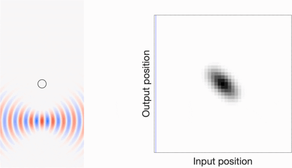
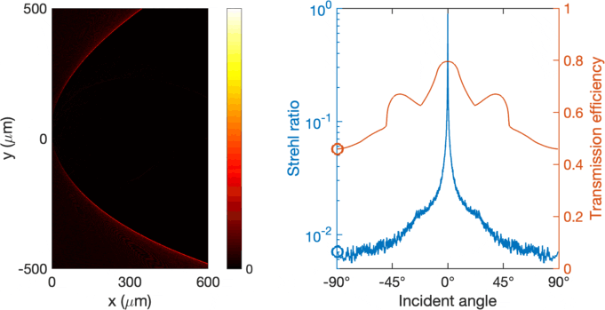

# MESTI

**MESTI** (Maxwell's Equations Solver with Thousands of Inputs) is an open-source software for electromagnetics simulations in frequency domain. It obtains full-wave solutions of Maxwell's equations using finite-difference discretization. It implements the **augmented partial factorization (APF)** method described in [arXiv:2203.xxxxx](https://arxiv.org/abs/2203.xxxxx), which can jointly perform thousands of simulations with different input source profiles, using less computing resources than what a typical direct method uses to perform a single simulation.

MESTI.m uses MATLAB and considers transverse-magnetic (TM) waves in 2D. A 3D vectorial version of MESTI written in Julia is under development and will be released in the future.

MESTI is a general-purpose solver written to provide maximal flexibility. The user can specify arbitrary permittivity profiles *ε*(*x*,*y*), arbitrary lists of input sources (user-specified or automatically built), and arbitrary lists of output projections (or no projection, in which case the complete field profiles are returned). Being in frequency domain, it can naturally handle any material dispersion *ε*(ω). MESTI implements all of the common boundary conditions, [perfectly matched layer (PML)](https://en.wikipedia.org/wiki/Perfectly_matched_layer) with both imaginary and real coordinate stretching, as well as exact outgoing boundaries in two-sided or one-sided geometries. In addition to APF, MESTI also implements conventional direct methods.

## Installation

No installation is required for MESTI itself; just download it and add the <code>MESTI.m/src</code> folder to the search path using the <code>addpath</code> command in MATLAB. The MATLAB version should be R2019b or later. (Using an earlier version is possible but requires minor edits.)

However, to use the APF method, the user needs to install the MUMPS package and its MATLAB interface. Without MUMPS, MESTI will still run but will only use other methods, which generally take longer and use more memory. So, MUMPS installation is strongly recommended for large-scale simulations or whenever efficiency is important. See this [MUMPS installation](./mumps) page for steps to install MUMPS.

## Functions 

The function <code>mesti(syst, B, C, D)</code> provides the most flexibility. The user can use <code>syst</code> to specify arbitrary permittivity profiles, any combination of boundary conditions, PML on any or all sides, the wavelength, and discretization grid size. Any list of input source profiles can be specified with <code>B</code>, and any list of output projection profiles can be specified with <code>C</code>; matrix <code>D</code> subtracts the baseline contribution for scattering matrix computations.

The function <code>mesti2s(syst, in, out)</code> deals specifically with scattering problems in two-sided or one-sided geometries where *ε*(*x*,*y*) consists of an inhomogeneous scattering region with homogeneous spaces on the left (*-x*) and right (*+x*), light is incident from the left and/or right, the boundary condition in *x* is outgoing, and the boundary condition in *y* is closed (*e.g.*, periodic or perfect electric conductor). The user only needs to specify the input and output channel indices or wavefronts through <code>in</code> and <code>out</code>; <code>mesti2s()</code> builds the list of input source profiles and output projection profiles, and then calls <code>mesti()</code> for the computation. <code>mesti2s()</code> also offers the additional features of (1) exact outgoing boundaries in *x* based on the Green's function in free space, and (2) the recursive Green's function method from the [RGF](https://github.com/chiaweihsu/RGF) repository; they are efficient for 1D systems and for 2D systems where the width in *y* is not large. 

To compute the complete field profiles, simply omit the argument <code>C</code> or  <code>out</code>, or set it to <code>[]</code>.

Detailed usage of these functions are given in the documentation section (comment lines at the beginning) of the <code>.m</code> function files in the [src](./src) folder. For example, typing <code>help mesti</code> in MATLAB brings up the full documentation for <code>mesti()</code>.

In addition, the user can use the function <code>mesti_build_channels()</code> to build the input and/or output matrices when using <code>mesti()</code>, or to determine which subset of the channels are of interest when using <code>mesti2s()</code>.

MESTI has two other functions <code>mesti_build_fdfd_matrix()</code> and <code>mesti_matrix_solver()</code> that are also general purpose, but most users shouldn't need to use them directly.

## Examples

Examples in the [examples](./examples) folder illustrate the usage and the main functionalities of MESTI. Each example has its own folder, with its <code>.m</code> script, auxiliary files specific to that example, and a <code>README.md</code> page that shows the example script with its outputs:

1. [Fabry–Pérot etalon](./examples/1d_fabry_perot): 1D, using <code>mesti2s()</code>, with comparison to analytic solution.
2. [Distributed Bragg reflector](./examples/1d_distributed_bragg_reflector): 1D, using <code>mesti2s()</code>, with comparison to analytic solution.
3. [Open channel in a disordered system](./examples/2d_open_channel_through_disorder): 2D, using <code>mesti2s()</code>, transmission matrix & field profile with customized wavefronts.
4.  [Reflection matrix in Gaussian-beam basis](./examples/2d_reflection_matrix_Gaussian_beams): 2D, using <code>mesti()</code>, reflection matrix in customized basis for a fully open system.
5. [Meta-atom design for metasurfaces](./examples/2d_meta_atom): 2D, using <code>mesti2s()</code> with Bloch periodic boundary.
6. [Angle dependence of a mm-wide metalens](./examples/2d_metalens): 2D, using <code>mesti()</code> with compressed input/output matrices (APF-c).

More examples will be added in the future.

## Gallery
Here are some images from the examples above:

1. Propagation through a Fabry–Pérot etalon
 

2. Open channel propagating through disorder
 

3. Reflection matrix of a scatterer in Gaussian-beam basis:
 

4. Angle dependence of a mm-wide hyperbolic metalens
 

## Reference & Credit

For more information on the theory, capability, and benchmarks (*e.g.*, scaling of computing time, memory usage, and accuracy), please see:

- Ho-Chun Lin, Zeyu Wang, and Chia Wei Hsu, "Full-wave solver for massively-multi-channel optics using augmented partial factorization,"  [arXiv:2203.xxxxx](https://arxiv.org/abs/2203.xxxxx) (2022).

Please cite this paper when you use MESTI.

