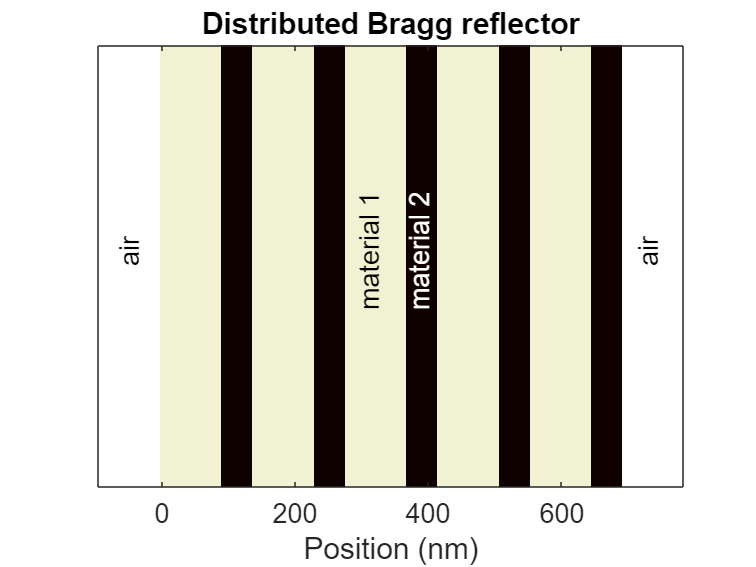
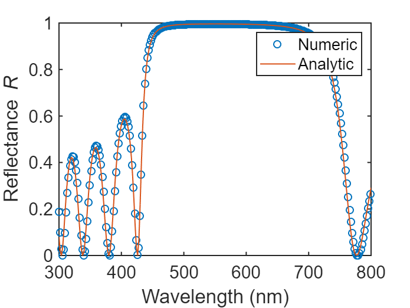
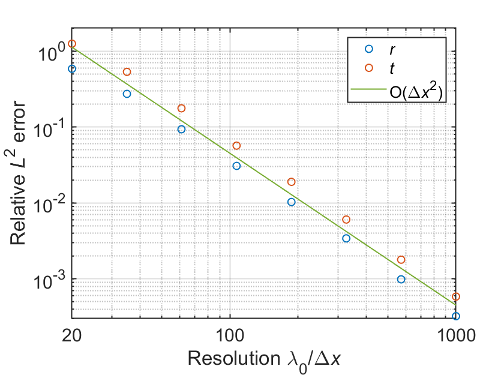

# Distributed Bragg reflector


Example of a alternating sequence of layers of two dielectric material (also called a distributed Bragg reflector (DBR)) using SCSA 


Use MESTI2S() to compute 


1.The wavelength-dependent reflectance spectrum from DBR and the conservation of energy (T + R = 1)

2.Discretization error with respect to the resolution


# System parameters

```matlab:Code
clear

n_bg = 1; % Refractive index of background material (air)
n1 = 1.5; % Refractive index of material 1
n2 = 3; % Refractive index for material 2
lambda_mid_gap = 550; % Mid-gap wavelength for DBR [nm]
d1 = lambda_mid_gap/(4*n1); % Thickness of material 1 in a pair [nm]
d2 = lambda_mid_gap/(4*n2); % Thickness of material 2 in a pair [nm]
n_pair = 5; % Number of pair in DBR

% Here is free-space wavelength.
lambda_min = 300; % Minimum wavelength [nm]
lambda_max = 800; % Maximum wavelength [nm]
delta_lambda = 2; % Increment of wavelength [nm]
lambda_list = lambda_min:delta_lambda:lambda_max; % Wavelength list to be used
lambda_0 = lambda_list(round(size(lambda_list,2)/2)); % Central wavelength [nm]
n_lambda= size(lambda_list,2); % Total number of wavelength
```

# Analytical result


Calculate the analytical results for this system. 


```matlab:Code
% Calculate the analytical reflection coefficient and transmission coefficient for this system. 
% Please refer to the function dbr_analytical.
[r_list_analytical,t_list_analytical] = dbr_analytical(n_bg, n1, n2, d1, d2, n_pair, lambda_list);
T_list_analytical = abs(t_list_analytical).^2; % Analytical transmittance
R_list_analytical = abs(r_list_analytical).^2; % Analytical reflectance
```

# General setup for mesti2s()


Set up general input argument for the mesti2s() for this system.


```matlab:Code
% Setup input arguments for mesti2s(). 
syst.epsilon_L = n_bg^2;  % Relative permittivity on the left hand side
syst.epsilon_R = n_bg^2;  % Relative permittivity on the right hand side
syst.yBC = 'periodic'; % Periodic boundary along transverse direction
syst.length_unit = 'nm'; % Length unit.
opts.verbal = false; % Suppress output information.
in = {'left'}; % Specify input channel on the left.
out = {'left', 'right'}; % Specify output channel on the left and the right.
```

# Reflectance spectrum


Calculate reflectance spectrum over visible wavelength for resolution = 60 with respect to central wavelength.


```matlab:Code
resolution = 60; % Resolution at the central wavelength \lambda_0
dx = lambda_0/resolution; % Grid size [nm]
syst.dx = dx; % Grid size as an input argument for mesti2s().

% Build permittivity for the dielectric slab. 
% Please refer to the function build_epsilon_dbr.
syst.epsilon = build_epsilon_dbr(dx, n_bg, n1, n2, d1, d2, n_pair);
[ny, nx] = size(syst.epsilon);

% Plot refractive index profile of DBR
n_extra_for_plot = 10; % Extra pixels on side for plotting
x = [-n_extra_for_plot*dx (nx+n_extra_for_plot)*dx]; % For plotting the space position

clf
imagesc(x, [], [syst.epsilon_L*ones(1,n_extra_for_plot), syst.epsilon, 1*syst.epsilon_R*ones(1,n_extra_for_plot)])
colormap(flipud(pink));
xlabel('Position (nm)');
yticks([])
text(-50,1,'air','FontSize',15,'Rotation',90)
text(310,1.1,'material 1','FontSize',15,'Rotation',90)
text(385,1.1,'material 2','FontSize',15,'color','white','Rotation',90)
title(['Distributed Bragg reflector'],'FontSize',15)
text(730,1,'air','FontSize',15,'Rotation',90)
set(gca, 'fontsize', 15, 'FontName','Arial')
```





```matlab:Code
R_list = zeros(1,n_lambda); % List of reflectance
T_list = zeros(1,n_lambda); % List of transmittance

% Looping over different wavelength to calculate reflectance spectrum    
for ii = 1:n_lambda
    syst.wavelength = lambda_list(ii); % Wavelength [nm]

    % Call mesti2s() to calculate the scattering matrix.
    [smatrix, channels, stat] = mesti2s(syst, in, out, opts);

    % In 1D, in = {'left'} and out = {'left', 'right'},
    % the smatrix = [r, t], where r is reflection coefficient from left to
    % left and t is transmission coefficient from left to right.

    r = smatrix(1,1); % Reflection coefficient
    t = smatrix(2,1); % Transmission coefficient

    R_list(ii) = abs(r).^2; % Reflectance
    T_list(ii) = abs(t).^2; % Transmittance
end

% Plot and compare numerical and analytical reflectance results
clf
plot(lambda_list,R_list,'o','linewidth',1)
hold on
plot(lambda_list,R_list_analytical,'linewidth',1)
xlabel('Wavelength (nm)');
xlim([300,800])
ylim([0,1])
legend('Numeric', 'Analytic', 'Location','northeast')
ylabel('Reflectance{\it R}');
set(gca, 'fontsize', 15, 'FontName','Arial')
set(gca,'linewidth',1)
```





```matlab:Code

% Print out the numerical confirmation of energy conservation
fprintf(['The energy conservation is checked numerically\n' ...
'through the max(|1 - T - R|) = %6.3g over the spectrum \n'], ...
max(abs(1-R_list-T_list)));
```

`The energy conservation is checked numerically through the max(|1 - T - R|) =  4e-15 over the spectrum`

# L2 norm ratio error for r and t over resolution


Over different resolution, compute L2 norm ratio error of numerical result with respect to the analytical to show discretization error.


```matlab:Code
resolution_list = round(exp(linspace(log(2e1),log(1e3),8))); % Resolution list to be used
n_resolution= size(resolution_list,2); % Total number of resolutions to be used
l2_norm_ratio_t = zeros(1,n_resolution); % L2 norm ratio list for t to be calculated
l2_norm_ratio_r = zeros(1,n_resolution); % L2 norm ratio list for r to be calculated

for ii = 1:n_resolution
    resolution = resolution_list(ii); % Resolution at the central wavelength \lambda_0
    dx = lambda_0/resolution; % Grid size of system [nm]
    syst.dx = dx; % Grid size as an input argument for mesti2s().
    
    % Build permittivity for the DBR. Please refer to the function build_epsilon_dbr.
    syst.epsilon = build_epsilon_dbr(dx, n_bg, n1, n2, d1, d2, n_pair);
    [ny, nx] = size(syst.epsilon);

    last_pixel_bg_ratio = ceil((d2+d1)*n_pair/dx)-(d2+d1)*n_pair/dx; % Ratio of last pixel is background

    r_list = zeros(1,n_lambda); % List of reflection coefficient
    t_list = zeros(1,n_lambda); % List of transmission coefficient
    for jj = 1:n_lambda
        syst.wavelength = lambda_list(jj); % Wavelength [nm]
    
        % Call mesti2s() to calculate the scattering matrix.
        [smatrix, channels, stat] = mesti2s(syst, in, out, opts);
    
        r = smatrix(1,1); % Reflection coefficient
        t = smatrix(2,1); % Transmission coefficient

        % Shift the extra background ratio (if any) to compare analytical result.
        t_list(jj) = t/exp(1i*last_pixel_bg_ratio*channels.R.kxdx_prop); 
        r_list(jj) = r;
    end
    % Compute the L2 norm ratio error for r and t.
    l2_norm_ratio_r(ii) = norm(abs(r_list_analytical-r_list))/norm(abs(r_list_analytical));
    l2_norm_ratio_t(ii) = norm(abs(t_list_analytical-t_list))/norm(abs(t_list_analytical));
end

% Plot L2 norm ratio error with respect to resolution
clf
loglog(resolution_list,l2_norm_ratio_r,'o','linewidth',1)
hold on
loglog(resolution_list,l2_norm_ratio_t,'o','linewidth',1)
hold on
% Reference asymptotic line
X = 10.^(1:4);
Y = 450*X.^(-2);
loglog(X,Y,'-','linewidth',1, 'Color', '#77AC30')
grid on
xticks([2e1 1e2 1e3]);
yticks([1e-4 1e-3 1e-2 1e-1 1e0]);
xlabel('Resolution \lambda_0/\Deltax');
ylabel('Relative L^2 error');
xlim([2e1, 1e3])
ylim([3e-4, 2e0])
legend('{\itr}','{\itt}','O(\Deltax^2)')
set(gca, 'fontsize', 15, 'FontName','Arial')
set(gca,'linewidth',1)
```




