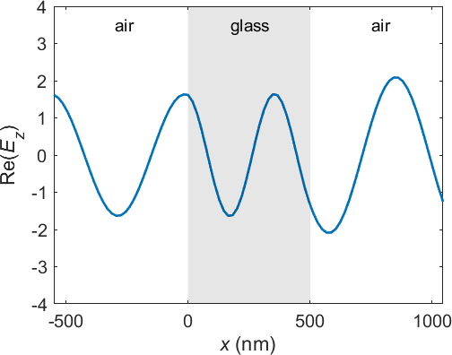
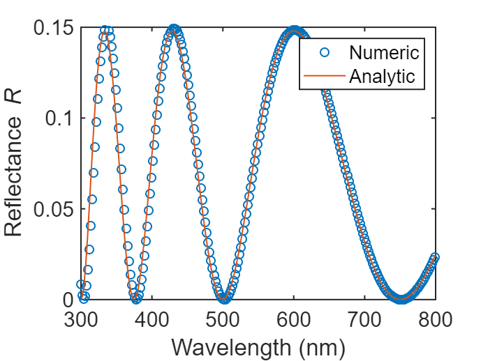
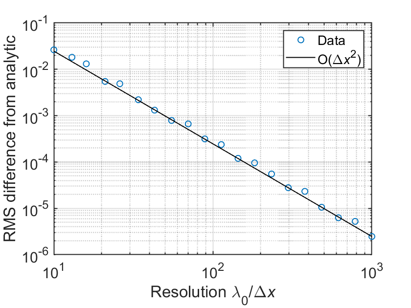

# Fabry-Perot etalon


Example of a dielectric slab (also called a Fabry-Perot etalon) using SCSA 


Use MESTI2S() to compute 

1.The field profile of the system and showing the field propagation 

2.The wavelength-dependent reflectance spectrum from Fabry-Perot etalon and the conservation of energy (T + R = 1)

3.The convergence of the numerical results with respect to resolution


# System parameters

```matlab:Code
clear

% System parameters
n_bg = 1;         % Refractive index of background material (air)
n_slab = 1.5;     % Refractive index of the dielectric slab (glass)
thickness = 500;  % Thickness of the dielectric slab [nm]

% Here is free-space wavelength.
lambda_min = 300; % Minimum wavelength [nm]
lambda_max = 800; % Maximum wavelength [nm]
delta_lambda = 2; % Increment of wavelength [nm]
lambda_list = lambda_min:delta_lambda:lambda_max; % Wavelength list to be used
lambda_0 = lambda_list(round(size(lambda_list,2)/2)); % Central wavelength [nm]
n_lambda= size(lambda_list,2); % Total number of wavelength
```

# Analytical result


Calculate the analytical results for this system. 

```matlab:Code
% Please refer to the function fp_analytical.
[r_list_analytical, t_list_analytical] = fp_analytical(n_bg, n_slab, thickness, lambda_list);
T_list_analytical = abs(t_list_analytical).^2; % Analytical transmittance
R_list_analytical = abs(r_list_analytical).^2; % Analytical reflectance
```

# General setup for mesti2s()


Set up general input argument for the mesti2s() for this system.

```matlab:Code
% Setup input arguments for mesti2s(). 
syst.epsilon_L = n_bg^2;  % Relative permittivity on the left hand side
syst.epsilon_R = n_bg^2;  % Relative permittivity on the right hand side
syst.yBC = 'periodic';    % Periodic boundary along transverse direction
syst.length_unit = 'nm';  % Length unit
```

# Field profile


Calculate field profile of the system for resolution = 30 in wavelength = 550 nm.

```matlab:Code
% Setup discrete system for resolution = 30 with respect to central wavelength. 
% The resolution is chosen based on lambda/dx = lambda_0/(n*dx) = 20 in the 
% highest refractive index material in this system.
resolution = 30; % Resolution at the central wavelength \lambda_0 
dx = lambda_0/resolution; % Grid size [nm]
syst.dx = dx; % Grid size as an input argument for mesti2s().
syst.wavelength = lambda_0; % Wavelength as an input argument for mesti2s() [nm]
nx = ceil((thickness)/dx); % Number of longitudinal pixels for the slab
ny = 1; % Only 1 pixel needed along transverse direction in 1D system

% Build permittivity for the dielectric slab.
syst.epsilon = n_slab^2*ones(ny, nx);
last_pixel_bg_ratio = ceil((thickness)/dx) - thickness/dx; % Ratio of last pixel is background
last_pixel_slab_ratio = 1-last_pixel_bg_ratio; % Ratio of last pixel is slab
% Average permittivity in last pixel of slab.
syst.epsilon(:, nx) = (n_slab^2*last_pixel_slab_ratio+ n_bg^2*last_pixel_bg_ratio); 

in = {'left'}; % Specify input channel on the left.
opts.nx_L = round(lambda_0/dx); % Pixels of homogeneous space on the left
opts.nx_R = round(lambda_0/dx); % Pixels of homogeneous space on the right
opts.verbal = false; % Suppress output information.

% Call mesti2s() to calculate the spatial field profile.
[Ez, stat] = mesti2s(syst, in, [], opts);

% For plotting the space position
x = ((1:(opts.nx_L+nx+opts.nx_R)))*dx - (opts.nx_L+1)*dx; %[nm]
% For plotting the slab region
slab_x = [x(opts.nx_L+1) x(opts.nx_L+1) ... 
          x(opts.nx_L+nx)+last_pixel_slab_ratio*dx ...
          x(opts.nx_L+nx)+last_pixel_slab_ratio*dx];
slab_y = [-4 4 4 -4]; 

% Animate the field profile propagation.
for ii = 1:3
    for jj = 1:50
        plot(x, real(Ez*exp(-1i*2*pi*jj/50)),'linewidth',2)
        patch(slab_x, slab_y, 'r', 'FaceColor', 'black', 'FaceAlpha', 0.1, 'LineStyle','none')
        xlim([x(1), x(end)])
        ylim([-4, 4])        
        xlabel('{\itx} (nm)')
        ylabel('Re({\itE_z})')
        text(-300,3.5,'air','FontSize',14)
        text(175,3.5,'glass','FontSize',14)  
        text(750,3.5,'air','FontSize',14)        
        set(gca, 'fontsize', 15, 'FontName','Arial')
        drawnow
        pause(0.05)
    end
end
```




# Reflectance spectrum


Calculate reflectance spectrum over visible wavelength for resolution = 30 with respect to central wavelength.

```matlab:Code
opts = [];
in = {'left'}; % Specify input channel on the left.
out = {'left', 'right'}; % Specify output channel on the left and the right.
opts.verbal = false; % Suppress output information.

R_list = zeros(1,n_lambda); % List of reflectance
T_list = zeros(1,n_lambda); % List of transmittance

% Looping over different wavelength to calculate reflectance spectrum
for ii = 1:n_lambda
    syst.wavelength = lambda_list(ii); % Wavelength [nm]
       
    % Call mesti2s() to calculate the scattering matrix.
    [smatrix, channels, stat] = mesti2s(syst, in, out, opts);

    % In 1D, in = {'left'} and out = {'left', 'right'},
    % the smatrix = [r, t], where r is reflection coefficient from left to
    % left and t is transmission coefficient from left to right.

    r = smatrix(1,1); % Reflection coefficient
    t = smatrix(2,1); % Transmission coefficient

    R_list(ii) = abs(r).^2; % Numerical reflectance
    T_list(ii) = abs(t).^2; % Numerical transmittance
end

% Plot and compare numerical and analytical reflectance results
clf
plot(lambda_list,R_list,'o','linewidth',1)
hold on
plot(lambda_list,R_list_analytical,'linewidth',1)
xlabel('Wavelength (nm)')
ylabel('Reflectance{\it R}')
xlim([300,800])
ylim([0,0.15])
legend('Numeric', 'Analytic', 'Location','northeast')
set(gca, 'fontsize', 15, 'FontName','Arial')
set(gca,'linewidth',1)
```





```matlab:Code
% Print out the numerical confirmation of energy conservation
fprintf(['The energy conservation is checked numerically\n' ...
'through the max(|1 - T - R|) = %6.3g over the spectrum.\n'] ...
,max(abs(1-R_list-T_list)))
```

The energy conservation is checked numerically through the max(|1 - T - R|) = 2.78e-15 over the spectrum.

# Convergence with resolution


Over different resolution, compute root-mean-square error (RMSE) of numerical result with respect to the analytical to show convergence.

```matlab:Code
resolution_list = round(exp(linspace(log(1e1),log(1e3),8))); % Resolution list to be used
n_resolution= size(resolution_list,2); % Total number of resolutions to be used
RMSE_R = zeros(1,n_resolution); % RMSE for R to be calculated
RMSE_T = zeros(1,n_resolution); % RMSE for T to be calculated

% Looping over different resolution
for ii = 1:n_resolution
    resolution = resolution_list(ii); % Resolution at the central wavelength (550 nm)
    dx = lambda_0/resolution; % Grid size of system [nm]
    syst.dx = dx; % Grid size as an input argument for mesti2s().
    nx = ceil((thickness)/dx); % Number of longitudinal pixels for the slab
    ny = 1; % Only 1 pixel needed along transverse direction in 1D system

    % Build permittivity for the dielectric slab.
    syst.epsilon = n_slab^2*ones(ny, nx);

    last_pixel_bg_ratio = ceil((thickness)/dx) - thickness/dx; % Ratio of last pixel is background
    last_pixel_slab_ratio = 1-last_pixel_bg_ratio; % Ratio of last pixel is slab
    % Average permittivity in last pixel of slab.
    syst.epsilon(:, nx) = (n_slab^2*last_pixel_slab_ratio+ n_bg^2*last_pixel_bg_ratio); 

    R_list = zeros(1,n_lambda); % List of reflectance
    T_list = zeros(1,n_lambda); % List of transmittance

    % Looping over different wavelength
    for jj = 1:n_lambda
        syst.wavelength = lambda_list(jj); % Wavelength [nm]

        % Call mesti2s() to calculate the scattering matrix.
        [smatrix, channels, stat] = mesti2s(syst, in, out, opts);

        R_list(jj) = abs(smatrix(1,1)).^2; % Numerical reflectance
        T_list(jj) = abs(smatrix(2,1)).^2; % Numerical transmittance
    end
    % Compute the RMSE for R and T.
    RMSE_R(ii) = sqrt(mean((R_list-R_list_analytical).^2));
    RMSE_T(ii) = sqrt(mean((T_list-T_list_analytical).^2));
end

% Plot RMSE with respect to resolution
clf
loglog(resolution_list,RMSE_R,'o','linewidth',1)
hold on
loglog(resolution_list,RMSE_T,'x','linewidth',1)
% Reference asymptotic line
X = 10.^(1:4);
Y = 0.7*X.^(-2)*10;
loglog(X,Y,'-','linewidth',1, 'Color', '#77AC30')
grid on
xticks([1e1 1e2 1e3])
yticks([1e-5 1e-4 1e-3 1e-2 1e-1 1e0])
xlabel('Resolution \lambda_0/\Delta{\itx}')
ylabel('Difference with analytic')
xlim([1e1, 1e3])
ylim([5e-6, 1e-1])
legend('{\itR}_{numeric}','{\itT}_{numeric}','O(\Delta{\itx}^2)')
set(gca, 'fontsize', 15, 'FontName','Arial')
set(gca,'linewidth',1)
```




