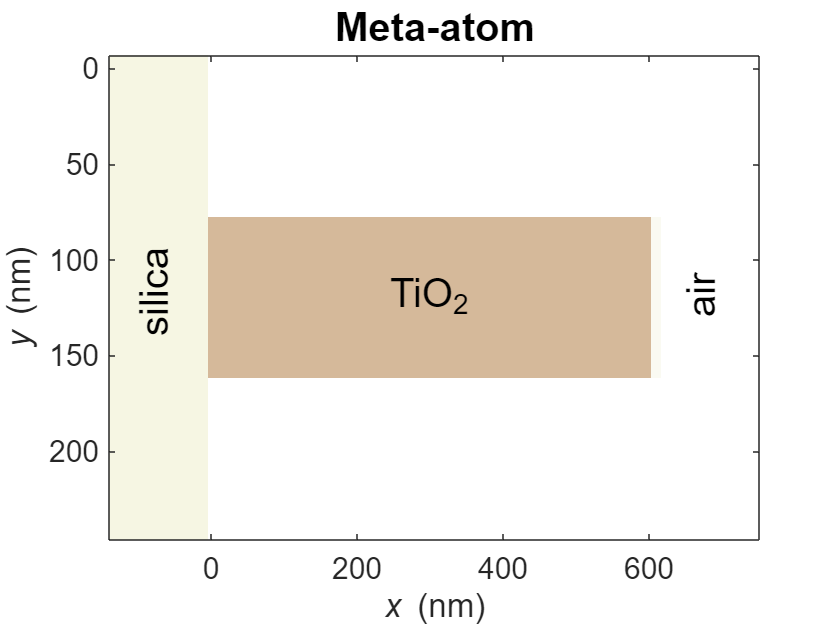
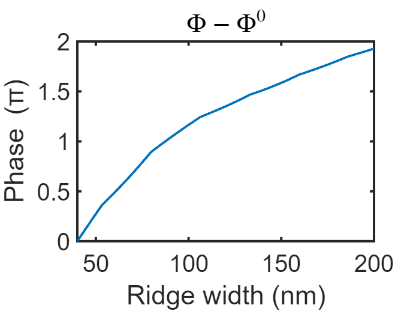

# Metalens: meta-atom


Example of TiO2 hyperbolic metalens using SCSA-c


Use MESTI2S() to 

1. Computing the transmission coefficient of meta-atom with different ridge width and find meta-atoms satisfying 8 discrete ideal relative phase over [0, 2pi). 

2. Scanning over ridge width and incident angle to get phase and amplitude map of transmission coefficient.

# System parameters

```matlab
clear

n_air    = 1;    % Refractive index of air
n_silica = 1.46; % Refractive index of silica
n_TiO2   = 2.43; % Refractive index of TiO2
lambda   = 532;  % Free-space wavelength [nm]
dx = lambda/40;  % Discretization grid size [nm]
w  = 18*dx;      % Width of meta-atom cell [nm]
l  = 600;        % Thickness of meta-atom cell [nm]
ridge_hight = l; % Ridge height is the thickness of meta-atom cell.
```

# General setup for mesti2s()

```matlab
% Setup input arguments for mesti2s(). 
syst.epsilon_L = n_silica^2; % Relative permittivity on the left hand side
syst.epsilon_R = n_air^2; % Relative permittivity on the right hand side
syst.wavelength = lambda; % Free-space wavelength [nm]
syst.dx = dx; % Grid size of system [nm]
syst.length_unit = 'nm'; %  Length unit
syst.yBC = 'periodic'; % Periodic boundary in y direction
in = {'left'}; % Specify input channel on the left.
out = {'right'}; % Specify output channel on the right.
opts.verbal = false; % Suppress output information.
```

# Structure of meta-atom

```matlab
% Plot refractive index profile of meta-atom
ridge_width = 79.8; % Ridge width of meta-atom [nm]
% Build permittivity for the meta-atom. 
% Please refer to the function build_epsilon_meta_atom.    
epsilon_meta_atom = build_epsilon_meta_atom(dx, n_air, n_TiO2, ridge_width, ridge_hight, w);
[ny, nx]= size(epsilon_meta_atom);
n_extra_for_plot = 10; % Extra pixels on side for plotting
% For ploting the space position
y = [0 ny*dx];
x = [-n_extra_for_plot*dx (nx+n_extra_for_plot)*dx]; 
clf
imagesc(x, y, [syst.epsilon_L*ones(ny,n_extra_for_plot), epsilon_meta_atom, 1*syst.epsilon_R*ones(ny,n_extra_for_plot)])
colormap(flipud(pink));
xlabel('{\itx} (nm)');
ylabel('{\ity} (nm)');
set(gca, 'fontsize', 15, 'FontName','Arial')
caxis([1 12])
text(670,130,'air','FontSize',20,'Rotation',90)
text(240,120,'TiO_2','FontSize',20)
text(-80,140,'silica','FontSize',20,'Rotation',90)
title(['Meta-atom'],'FontSize',20)
```


 

# Transmission coefficient of meta-atom with different ridge width

```matlab
ridge_width_list = 40:0.1:200; % List of ridge width: from 40 nm to 200 nm with 0.1 nm increment
t_list = zeros(1,size(ridge_width_list,2)); % Transmission coefficient list

% Looping over different ridge width
for ii =1:length(ridge_width_list)
    ridge_width = ridge_width_list(ii); % Ridge width of meta-atom [nm]
    syst.epsilon = build_epsilon_meta_atom(dx, n_air, n_TiO2, ridge_width, ridge_hight, w);
    % Call mesti2s() to calculate the scattering matrix.
    [S, stat] = mesti2s(syst, in, out, opts);        
    t_list(1,ii) = S(1,1);
end

phi0 = angle(t_list(ridge_width_list==194)); % Use the ridge width = 194 nm meta-atom as a phase reference.
rel_phi_over_pi_list = mod(angle(t_list)-phi0, 2*pi)/pi; % Relative phase over different ridge width

% Plot the relative phase of meta-atom with different ridge width
clf
plot(ridge_width_list, rel_phi_over_pi_list, '-','linewidth', 2)
xlabel('Ridge width (nm)')
ylabel('Phase (\pi)')
xlim([40 200])
title('$\Phi - \Phi^0$', 'Interpreter','latex')
set(gca, 'fontsize', 20, 'FontName','Arial')
set(gca,'linewidth', 2)
```


 

# Finding meta-atoms satisfying 8 discrete ideal relative phase over [0, 2pi)

```matlab
ideal_rel_phase_over_pi_list = [linspace(0.25, 1.75, 7) 0]; % Have 8 discrete ideal relative phases over [0, 2pi).

% Find meta-atoms which are closest to the ideal relative phase through nearest neighbor interpolation.
ind = interp1(rel_phi_over_pi_list,1:length(rel_phi_over_pi_list),ideal_rel_phase_over_pi_list,'nearest');
phi_over_pi_design_list = rel_phi_over_pi_list(ind); 
ridge_width_desgin_list = ridge_width_list(ind); 

% Print the relative phases and ridge widths.
fprintf(['Relative phase.(pi) %5.2f %5.2f %5.2f %5.2f %5.2f %5.2f %5.2f %5.2f\n' ...
         'Ridge width....(nm) %5.1f %5.1f %5.1f %5.1f %5.1f %5.1f %5.1f %5.1f\n'],...
         phi_over_pi_design_list,ridge_width_desgin_list);
```

Relative phase.(pi) &nbsp; 0.25 &nbsp; 0.50 &nbsp; 0.75 &nbsp; 1.00 &nbsp; 1.25 &nbsp; 1.50 &nbsp; 1.75 &nbsp; 0.00<br>
Ridge width....(nm) &nbsp; 45.2 &nbsp; 55.1 &nbsp; 68.1 &nbsp; 79.8 &nbsp; 98.4 125.1 156.9 194.0<br>


```matlab
% Save the phase list and the ridge width list.
save('meta_atom.mat','ridge_width_desgin_list','phi_over_pi_design_list')
```

# Phase and amplitude map of transmission coefficient of meta-atom with ridge width and incident angle

```matlab
syst.yBC = 'Bloch'; % Bloch periodic boundary along transverse direction

ridge_width_list = 40:4:200; % List of ridge width: from 40 nm to 200 nm with 4 nm increment
% Note that this incident angle is with respect to air, theta_in = asin(n_sub*sin(theta_sub)).
theta_in_list = -89:1:89; % List of incident angle [degree]

k0dx = 2*pi/lambda*dx; % Dimensionless frequency k0dx

% Given theta, solve the corresponding kydx by the finite-difference dispersion
% Eq. (S22) in the supplementary of the SCSA paper.
syms x
kydx_list = zeros(1,size(theta_in_list,2));
for jj = 1:size(theta_in_list,2)
    if theta_in_list(jj) == 0
        kydx_list(jj) = 0;    
    elseif theta_in_list(jj) > 0
        eqn = (k0dx)^2*n_silica^2 == 4*(sin(x/2))^2 + 4*(sin(x/tan(asin(1/n_silica*sind(theta_in_list(jj))))/2))^2;
        kydx_list(jj) = vpasolve(eqn,x,[0 2*pi]);
    elseif theta_in_list(jj) < 0        
        eqn = (k0dx)^2*n_silica^2 == 4*(sin(x/2))^2 + 4*(sin(x/tan(asin(1/n_silica*sind(theta_in_list(jj))))/2))^2;
        kydx_list(jj) = vpasolve(eqn,x,[-2*pi 0]);
    end
end

t_list = zeros(size(kydx_list,2), size(ridge_width_list,2));  % Transmission coefficient list 
% Row index for different incident and column index for different ridge width
phi0_list = zeros(size(kydx_list,2), size(ridge_width_list,2)); % Reference phase list

for ii = 1:length(ridge_width_list)
    ridge_width = ridge_width_list(ii); % Ridge width of meta-atom [nm]
    syst.epsilon = build_epsilon_meta_atom(dx, n_air, n_TiO2, ridge_width, ridge_hight, w);
    for jj = 1:round(length(kydx_list))
        syst.ky_B = kydx_list(jj)/dx; % Bloch wave number
        % Call mesti2s() to calculate the scattering matrix.
        [S, channels, stat] = mesti2s(syst, in, out, opts); 

        % In some incident angles, there are more than one channel on the left.
        % Proper index should be chosen to extract the correct transmission coefficient for the phase/amplitude map.
        theta_inc = asind(sind(atand(channels.L.kydx_prop./channels.L.kxdx_prop))*n_silica); % Incident angle w.r.t. air of channels on the left
        ind = find(round(theta_inc)==theta_in_list(jj)); % Find the channel index whose incident angle is what users want.
        t_list(jj,ii) = S(1,ind);

        % Choose the ridge width = 40 nm meta-atom as a phase reference.
        if ridge_width == 40
            phi0_list(jj,:) = angle(S(1,ind)); 
        end
    end
end

% Plot the phase map of transmission coefficient over ridge width and incident angle.
clf
imagesc(ridge_width_list,theta_in_list, mod(angle(t_list)-phi0_list, 2*pi))
caxis([0, 2*pi]);
xlabel('Pillar width (nm)')
ylabel('\theta_{in} (degree)')
title('Phase')
colormap(twilight)
colorbar
hcb=colorbar; hcb.Ticks = [0 pi 2*pi]; hcb.TickLabels = {'0','\pi','2\pi'};
```


 


```matlab
clf
imagesc(ridge_width_list,theta_in_list, abs(t_list))
caxis([0, 1]);
xlabel('Pillar width (nm)')
ylabel('\theta_{in} (degree)')
title('Amplitude')
colormap('hot')
colorbar
```


 

