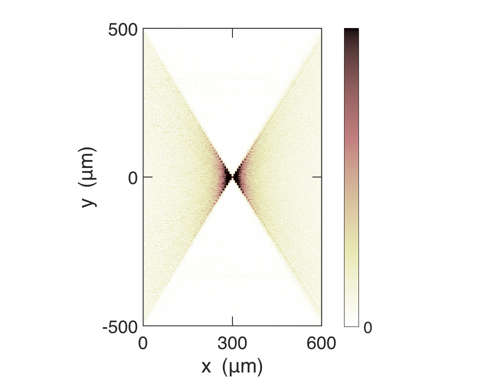
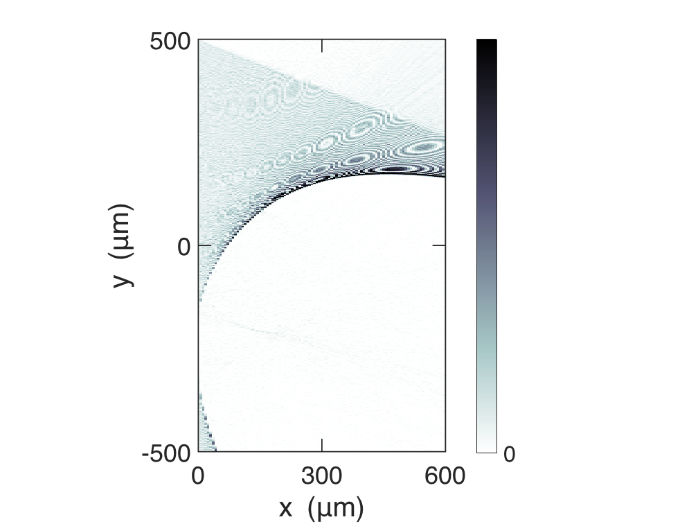
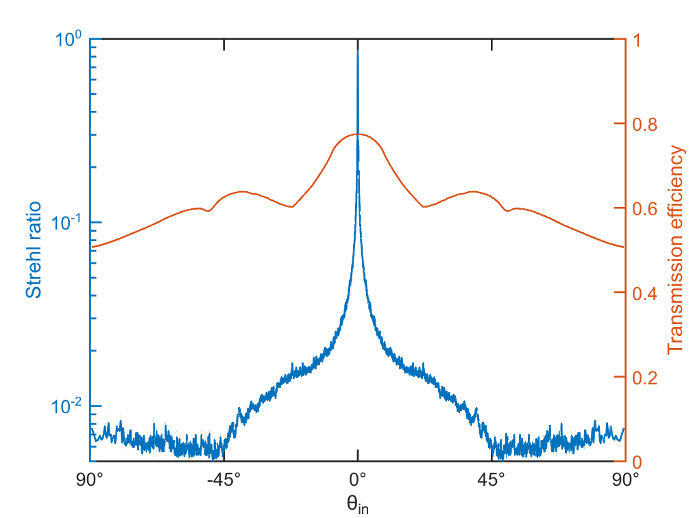

# Full-wave Transmission-Matrix Computation on a mm-wide Metalens


In this example, we:

   -  Build a mm-diameter high-NA hyperbolic metalens from the meta-atom results in [https://github.com/complexphoton/MESTI.m/tree/main/examples/2d_metalens_meta_atom.](https://github.com/complexphoton/MESTI.m/tree/main/examples/2d_metalens_meta_atom.) 
   -  Use mesti() to compute the transmission matrix of that mm-diameter metalens through SCSA-c. 
   -  Use angular spectrum propagation to obtain field profiles away from the metalens. 
   -  Map out the transmission efficiency and Strehl ratio for all incident angles. 

# System parameters

```matlab
clear 

% System parameters
n_air    = 1;    % Refractive index of air
n_silica = 1.46; % Refractive index of silica
n_TiO2   = 2.43; % Refractive index of TiO2
lambda   = 532;  % Free-space wavelength [nm]
dx = lambda/40;  % Discretization grid size [nm]
w  = 18*dx;      % Width of meta-atom cell [nm]
l  = 600;        % Thickness of meta-atom cell [nm]
```

# Construct the mm-wide hyperbolic metalens

```matlab
D_target = 1000; % Target diameter for the metalens [micron]
n_meta_atom = ceil(D_target*1e3/w); % Number of meta-atom to construct 1-mm metalens
ny_tot = ceil(w/dx)*n_meta_atom; % Total number of pixel for the 1-mm metalens in y direction

% Metalens parameters
D = n_meta_atom*w/1000; % Actual diameter of the metalens [micron]
focal_length = 300; % Focal length of the metalens [micron]
NA = sin(atan(D/(2*focal_length))); % Numerical aperture of the metalens

y_mid_cell = ((0.5:n_meta_atom) - (n_meta_atom/2))*w/1000; % Middle position of each meta-atom inside metalens [micron] 
target_phase = (2*pi/(lambda/1000))*(focal_length - sqrt(focal_length^2 + y_mid_cell.^2)); % Target phase of the hyperbolic metalens over each meta-atom 

% Load the 8 discrete ridge width list and its phase from meta_atom_design.mlx.
load('meta_atom.mat', 'ridge_width_desgin_list', 'phi_over_pi_design_list');

% Number of pixels for the meta-atom 
nx = ceil(l/dx);    
ny = ceil(w/dx);
ridge_hight = l; % Ridge height is the thickness of meta-atom cell.

% Construct epsilon library for 8 different meta-atom.
ridge_width_libaray = ridge_width_desgin_list;
epsilon_libaray = zeros(ny,nx,size(ridge_width_desgin_list,2)); % Storing the permittivity profile for 8 different meta-atoms.
for jj =1:length(ridge_width_desgin_list)
    ridge_width = ridge_width_desgin_list(jj); % Ridge width [nm]
    epsilon_libaray(:,:,jj)= build_epsilon_meta_atom(dx, n_air, n_TiO2, ridge_width, ridge_hight, w);
end

% Find the ridge width of each meta-atom in the metalens closest to the target phase. 
phi_over_pi_design_list(end) = 2; 
phi_over_pi_design_list = [0 phi_over_pi_design_list]; % Wrap up the phase.
ridge_width_desgin_list = [ridge_width_desgin_list(end)  ridge_width_desgin_list];
ridge_width_list_lens = interp1(phi_over_pi_design_list, ridge_width_desgin_list, mod(target_phase, 2*pi)/pi, 'nearest');

% Construct permittivity profile for whole metalens.
epsilon = zeros(ny_tot,nx);
% Looping over each meta-atom to construct the permittivity profile
for jj =1:length(ridge_width_list_lens)
    ridge_width = ridge_width_list_lens(jj);
    ind = find(ridge_width_libaray==ridge_width);
    epsilon((jj-1)*ny+(1:ny),:) = epsilon_libaray(:,:,ind);
end
```

# General setup for mesti()


Set up general input argument for the mesti() for this system.

```matlab
syst.length_unit = 'nm'; % Length unit
syst.wavelength = lambda; % Free-space wavelength [nm]
syst.dx = dx; % Grid size of system [nm]
% PML setup
PML.npixels = 10; % Number of pixels of PM
% Note that to compare the performance of common packages which set kappa_max = 1, here kappa_max is also to be 1. 
PML.kappa_max = 1; % Kappa_max 
nspacer = round(lambda/dx); % Number of pixels homogeneous space in front of PML
npml = PML.npixels;
syst.PML = PML; % Put PML on all four sides.

epsilon_L = n_silica^2; % Relative permittivity on the left hand side
epsilon_R = n_air^2; % Relative permittivity on the right hand side
[ny, nx] = size(epsilon); % Number of pixels in the hyperbolic metalens region along y and x direction

% Include PML, homogeneous space, and source/detection region in permittivity profile.
syst.epsilon = [epsilon_L*ones(ny+2*nspacer+2*npml,nspacer+npml+1),[epsilon_R*ones(nspacer+npml,nx); epsilon; epsilon_R*ones(nspacer+npml,nx)], epsilon_R*ones(ny+2*nspacer+2*npml,nspacer+npml+1)];

opts.use_continuous_dispersion = true; % Use continuous dispersion relation.
opts.use_transpose_B = true; % Transpose(B) will be used as C.
opts.prefactor = -2i;   % Prefactor for the source B
opts.clear_syst = true; % syst is not needed afterwards and can be cleared.
opts.clear_BC = true;   % B is not needed afterwards and can be cleared.
```

# Pre-processing for SCSA-c


Here we build the transformed input matrix phi*Q*F in Eq. (S38) and \tilde{B}.

```matlab
time1 = clock;

lambda_over_dx = syst.wavelength/syst.dx; % Ratio between free-space wavelength and dx
BC = 'periodic'; % Boundary condition for the channel
k0dx = 2*pi/lambda_over_dx;  % Dimensionless frequency k0dx
channels = mesti_build_channels(ny, BC, k0dx, epsilon_L, epsilon_R, opts.use_continuous_dispersion); % Set up the channels
% Number of channels considering in the scattering matrix
N_channel = channels.R.N_prop;
M_L = N_channel;  %Number of channels considered on the left; note we only consider channels that can propagate in air
M_R = N_channel; % Number of channels considered on the right

M_L_pad_half = 1000; % Number of half extra padded channels on the left
M_R_pad_half = 1000; % Number of half extra padded channels on the right
w_t_over_lambda_L = 10; % Truncation window over free-space wavelength on the left
w_t_over_lambda_R = 10; % Truncation window over free-space wavelength on the right
use_Hann_Q = true; % Use the weight matrix Q whose elements are Hann function.

w_t_over_dx_L = w_t_over_lambda_L*lambda_over_dx; % Truncation window over grid size on the left
w_t_over_dx_R = w_t_over_lambda_R*lambda_over_dx; % Truncation window over grid size on the right

% Total number of channels considering (origin channels and extra padded channels)
N_L = min([ny, M_L + 2*M_L_pad_half]);
N_R = min([ny, M_R + 2*M_R_pad_half]);

% Build matrix phiQF. 
% Please refer to the function build_phiQF.
[phiQF_L ,phiQF_R] = build_phiQF(ny, N_L, N_R, w_t_over_dx_L, w_t_over_dx_R, use_Hann_Q);

% Build up the whole matrix B_tilde; see Eq. (S26) in the supplementary of the SCSA paper paper.
B_tilde = [[sparse((ny+2*nspacer+2*npml)*(nspacer+npml), N_L); sparse(nspacer+npml, N_L); phiQF_L; sparse(nspacer+npml, N_L); sparse((ny+2*nspacer+2*npml)*(nx), N_L); sparse((ny+2*nspacer+2*npml), N_L); sparse((ny+2*nspacer+2*npml)*(nspacer+npml), N_L)],...
    [sparse((ny+2*nspacer+2*npml)*(nspacer+npml), N_L); sparse((ny+2*nspacer+2*npml), N_L); sparse((ny+2*nspacer+2*npml)*(nx), N_L); sparse(nspacer+npml, N_L); phiQF_R; sparse(nspacer+npml, N_L); sparse((ny+2*nspacer+2*npml)*(nspacer+npml), N_L)]];

time2 = clock; timing_build_pre = etime(time2,time1); % Calculate the timing for the pre-processing
```

# Call mesti()

```matlab
[S, stat] = mesti(syst, B_tilde, [], [], opts);
```
```
System size: ny = 75304, nx = 148
UPML on -x +x -y +y sides; xBC = PEC; yBC = PEC
Building B,C... elapsed time:   0.002 secs
Building A...   elapsed time:   5.367 secs
< Method: SCSA using MUMPS with AMD ordering (symmetric K) >
Building K...   elapsed time:   2.477 secs
Analyzing...    elapsed time:  11.387 secs
Factorizing...  elapsed time:  67.009 secs
          Total elapsed time:  87.555 secs
```
# Post-processing for SCSA-c


Perform decompression to obtain the scattering matrix. 

```matlab
time1 = clock;

ind_L = 1:N_L;
ind_R = (N_L+1):(N_L+N_R);

% Only take the transmission from left to right part.
t_L = S(ind_R,ind_L); 

% Do centered fft/ifft.
t_L = fftshift((ifft(ifftshift(fftshift((fft(ifftshift(t_L,1),[],1)),1),2),[],2)),2)/sqrt(N_R/N_L);

% Remove the extra padded channels.
ind_L = M_L_pad_half + (1:M_L);
ind_R = M_R_pad_half + (1:M_R);
t_L = t_L(ind_R,ind_L);

% If weight matrix Q (Hann function) is used, undo the weight.
if use_Hann_Q
    a_L = (-round((M_L-1)/2):round((M_L-1)/2)).';
    a_R = (-round((M_R-1)/2):round((M_R-1)/2)).';
    q_inv_L = spdiags(2./(1+cos((2*pi/N_L)*a_L)),0,M_L,M_L);
    q_inv_R = spdiags(2./(1+cos((2*pi/N_R)*a_R)),0,M_R,M_R);
    t_L = q_inv_R*t_L*q_inv_L;
end

% Multiply the sqrt(mu) prefactor
sqrt_mu_L = spdiags(channels.L.sqrt_mu(1,round(size(channels.L.sqrt_mu,2)/2)-round(M_L-1)/2: round(size(channels.L.sqrt_mu,2)/2)+round(M_L-1)/2).',0,M_L,M_L);
sqrt_mu_R = spdiags(channels.R.sqrt_mu.',0,M_R,M_R);
t_L = sqrt_mu_R*t_L*sqrt_mu_L; % The wanted transmission matrix 

time2 = clock; timing_build_aft = etime(time2,time1); % Calculate the timing for the post-processing.

fprintf('Total building and processing time: %7.3f secs\n', stat.timing.build+timing_build_pre+timing_build_aft);
```
```
Total building and processing time:  11.594 secs
```

```matlab
fprintf('Total elapsed time: %7.3f secs\n', stat.timing.total+timing_build_pre+timing_build_aft);
```
```
Total elapsed time:  91.303 secs
```
# Angular spectrum propagation parameters

```matlab
% System width used in the angular spectrum propagation.
% Here a very wide width is used to reduce artifacts from period wrapping (aliasing)
% This width can be greatly reduced using a window function or a PML.
W_FT = 20; % Fourier window [mm]

ny_source = ny; % Number of pixels for the source
ny_Ft = floor(W_FT*1e6/dx); % Number of pixels for the Fourier window
ny_pad = round((ny_Ft-ny_source)/2); % Extra pixels need to pad on one side
y_FT = ((0.5:ny_Ft) - (ny_Ft/2)).'*dx; % Transform pixel to y coordinate.

% kydx list for the angular spectrum propagation
if mod(ny_Ft,2) == 1
    ny_half = round((ny_Ft-1)/2);
    kydx = (2*pi/(ny_Ft))*[0:ny_half, -ny_half:-1].';
else
    ny_half = round(ny_Ft/2);
    kydx = (2*pi/(ny_Ft))*[0:ny_half, -(ny_half-1):-1].';
end

% Use continuous dispersion relation to have kxdx list for the angular spectrum propagation.
kxdx = sqrt(epsilon_R*k0dx^2 - kydx.^2);

% Build up phi_R_over_sqrt_mu_R and C_R; see Eqs. (S21) and (S29) in the supplementary of the SCSA paper.
N_out_R = channels.R.N_prop;
phi_R = channels.fun_phi(channels.R.kydx_prop);
phi_R_over_sqrt_mu_R = phi_R*spdiags(reshape(1./channels.R.sqrt_mu,[],1), 0, N_out_R, N_out_R);
C_R = spdiags(reshape(channels.R.sqrt_mu,[],1), 0, N_out_R, N_out_R)*(phi_R');
clear phi_R

% Obtain list of incident angles with respect to background (air) [degree]
ind = ((channels.L.N_prop-channels.R.N_prop)/2+1):(channels.L.N_prop+channels.R.N_prop)/2;
inc_angle_list = asin(sin(atand(channels.L.kydx_prop(ind)./channels.L.kxdx_prop(ind)))*n_silica); 
n_inc_angle = size(inc_angle_list,2); % Number of incident angles
```

# Intensity profiles of the transmitted light


Use angular spectrum propagation (ASP) to compute intensity profile away from the metalens, for incident angles of 0  degree and 30 degrees. 

```matlab
n_ASP = 101; % Number of ASP steps 
x_propagation_over_dx = 2*focal_length*1000/dx; % Propagation distance over dx along x direction (to 2*focal plane)
x_plot_over_dx_list = linspace(0, x_propagation_over_dx,n_ASP); % List of position to plot for the ASP

% \theta_in = 0 [degree]
Ez_SCSA_c = zeros(ny_Ft, size(x_plot_over_dx_list,2)); % Ez profile over space
theta_in = 0; % Desired incident angle
a_R = interp1(inc_angle_list,1:length(inc_angle_list),theta_in,'nearest'); % Find the closest angle that satisfy the desired one.
a_L = (round(channels.L.N_prop)-round(channels.R.N_prop))/2+a_R;
theta_in_real = asind(sind(atand(channels.L.kydx_prop(a_L)/channels.L.kxdx_prop(a_L)))*n_silica); % Real incident angle [degree]

% Angular spectrum propagation looping over space
for ii = 1: size(x_plot_over_dx_list,2)
    x_plot_over_dx = x_plot_over_dx_list(1,ii);
    Ez_0 = phi_R_over_sqrt_mu_R*t_L(:,a_R);
    Ez_0_FT = [zeros(ny_pad,1); Ez_0; zeros(ny_Ft-ny_source-ny_pad,1)];
    Ez_SCSA_c(:,ii) = ifft(exp(1i*kxdx*x_plot_over_dx).*fft(Ez_0_FT));
end

% Plot result of the intensity profile at 0 degree incidence.
figure
imagesc(x_plot_over_dx_list*dx/1000, y_FT/1000, 1e3*abs(Ez_SCSA_c).^2)
set(gca,'YDir','normal')
hold on
axis image
xlim([0 600])
ylim([-500 500])
c = colorbar;
c.Ticks = 0;
colormap(flipud(pink))
caxis([0 1])
set(gca,'linewidth',1)
xlabel('x (\mum)')
ylabel('y (\mum)')
yticks([-500 0 500])
xticks([0 300 600])
%title(['\theta_{\rm{in}} = ',sprintf('%4.1f', theta_in_real),char(176)]);
set(gca,'TickLength',[0.03 0.03])
set(gca,'fontsize',20);
```





```matlab
% \theta_in = 30 [degree]
Ez_SCSA_c = zeros(ny_Ft, size(x_plot_over_dx_list,2)); % Ez profile over space
% Find the closest angle that satisfy the desired one.
theta_in = 30; % Desired incident angle
a_R = interp1(inc_angle_list,1:length(inc_angle_list),theta_in,'nearest'); % Find the closest angle that satisfy the desired one.
a_L = (round(channels.L.N_prop)-round(channels.R.N_prop))/2+a_R;
theta_in_real = asind(sind(atand(channels.L.kydx_prop(a_L)/channels.L.kxdx_prop(a_L)))*n_silica); % Real incident angle [degree]

% Angular spectrum propagation looping over space
for ii = 1: size(x_plot_over_dx_list,2)
    x_propagation_over_dx = x_plot_over_dx_list(1,ii);
    Ez_0 = phi_R_over_sqrt_mu_R*t_L(:,a_R);
    Ez_0_FT = [zeros(ny_pad,1); Ez_0; zeros(ny_Ft-ny_source-ny_pad,1)];
    Ez_SCSA_c(:,ii) = ifft(exp(1i*kxdx*x_propagation_over_dx).*fft(Ez_0_FT));
end

% Plot result of the intensity profile in 30 degree.
figure
imagesc(x_plot_over_dx_list*dx/1000, y_FT/1000, 1e3*abs(Ez_SCSA_c).^2)
set(gca,'YDir','normal')
hold on
axis image
xlim([0 600])
ylim([-500 500])
c = colorbar;
c.Ticks = 0;
colormap(flipud(bone))
caxis([0 1])
set(gca,'linewidth',1)
xlabel('x (\mum)')
ylabel('y (\mum)')
yticks([-500 0 500])
xticks([0 300 600])
%title(['\theta_{\rm{in}} = ',sprintf('%4.1f', theta_in_real),char(176)]);
set(gca,'TickLength',[0.03 0.03])
set(gca,'fontsize',20);
```




# Angle dependence of the transmission efficiency and Strehl ratio


Here we


1. Calculate the transmission efficiency and field in the focal plane for an ideal lens.


2. Loop over different incident angles to calculate the transmission efficiency and Strehl ratio of the hyperbolic metalens.

```matlab
x_propagation_over_dx = focal_length*1000/dx; % Propagation distance over dx along x direction (to focal plane)

%% Calculate the transmission efficiency and Ez field in the focal passing through ideal lens
% Ideal phase profile in normal incidence angle
index_normal_L = round((channels.L.N_prop+1)/2); % Channel index for normal on the left
index_normal_R = round((channels.R.N_prop+1)/2); % Channel index for normal on the right

% Focal point position in y direction
y_focal_normal=focal_length*1000*sind(atand(channels.L.kydx_prop(index_normal_L)/channels.L.kxdx_prop(index_normal_L)))*n_silica;
% Position index for focal point along y direction
y_source = ((0.5:ny_source) - (ny_source/2))*dx;

% Discrete Fresnel equation for t coefficient at normal incidence (flux normalized)
kxdx_L = channels.L.kxdx_prop(index_normal_L);
kxdx_R = channels.R.kxdx_prop(index_normal_R);
t_normal = sqrt(sin(kxdx_R)/sin(kxdx_L))*(exp(1i*kxdx_L)-exp(-1i*kxdx_L))/(exp(1i*kxdx_R)-exp(-1i*kxdx_L));

ideal_phase_list = -(2*pi/(lambda))*(sqrt((focal_length*1000)^2 + (y_source - y_focal_normal).^2)).'; % The transmitted phase for ideal lens
ideal_field = t_normal*phi_R_over_sqrt_mu_R(:,index_normal_R).*exp(1i*ideal_phase_list); % The transmitted field for ideal lens

t_ideal = C_R*ideal_field; % Transmission matrix of ideal lens in normal incidence
Teff_ideal = sum(abs(t_ideal).^2); % Transmission efficiency for ideal lens in normal incidence

% Reconstruct Ez field from transmission matrix.
Ez_0 = phi_R_over_sqrt_mu_R*t_ideal;

% Use angular spectrum propagation to let the field propagate to the focal plane
Ez_0_FT = [zeros(ny_pad,1); Ez_0; zeros(ny_Ft-ny_source-ny_pad,1)];
Ez_focal_ideal = ifft(exp(1i*kxdx*x_propagation_over_dx).*fft(Ez_0_FT));

%% Calculate the transmission efficiency and Ez field in the focal passing through hyperbolic metalens
% Strehl ratio list for the hyperbolic lens to be calculated 
strehl_ratio_hyperbolic_SCSA_c = zeros(1, n_inc_angle); 
% transmission efficiency list for the hyperbolic lens to be calculated
transmission_efficiency_hyperbolic_SCSA_c = zeros(1, n_inc_angle); 

% Looping over different incident angles for the hyperbolic lens
for a_R= 1:n_inc_angle
    % Corresponding channel index on the left hand side
    a_L = (channels.L.N_prop-n_inc_angle)/2+a_R;
      
    Teff_hyperbolic = sum(abs(t_L(:,a_R)).^2); % Transmission efficiency for hyperbolic metalens
    transmission_efficiency_hyperbolic_SCSA_c(1,a_R) = Teff_hyperbolic;

    % Use angular spectrum propagation to let the field propagate to the focal plane.
    Ez_0 = phi_R_over_sqrt_mu_R*t_L(:,a_R);
    Ez_0_FT = [zeros(ny_pad,1); Ez_0; zeros(ny_Ft-ny_source-ny_pad,1)];
    Ez_focal_hyperbolic_SCSA_c(:,1) = ifft(exp(1i*kxdx*x_propagation_over_dx).*fft(Ez_0_FT)); % Ez profile in the focal plane after passing the hyperbolic lens

    % Strehl ratio
    strehl_ratio_hyperbolic_SCSA_c(a_R) = max(abs(Ez_focal_hyperbolic_SCSA_c(:,1)))^2/max(abs(Ez_focal_ideal(:,1)))^2 * (Teff_ideal/Teff_hyperbolic); 
end

% Plot results for Strehl ratio and transmission efficiency.
figure
yyaxis left
semilogy(inc_angle_list, strehl_ratio_hyperbolic_SCSA_c, 'linewidth', 1.5)
xlabel('\theta_{in}')
ylabel('Strehl ratio')
xlim([-90 90])
ylim([5e-3 1])
set(gca, 'fontsize', 15, 'FontName','Arial')
set(gca,'TickLength',[0.02 0.035])
set(gca,'linewidth',1.5)
yyaxis right
plot(inc_angle_list, transmission_efficiency_hyperbolic_SCSA_c, 'linewidth', 1.5)
ylabel('Transmission efficiency')
xlim([-90 90])
ylim([0 1])
xticks([-90 -45 0 45 90]);
xticklabels({['90', char(176)], ['-45', char(176)], ['0', char(176)], ['45', char(176)], ['90', char(176)],})
yticks([0 0.2 0.4 0.6 0.8 1]);
set(gca, 'fontsize', 15, 'FontName','Arial')
```




