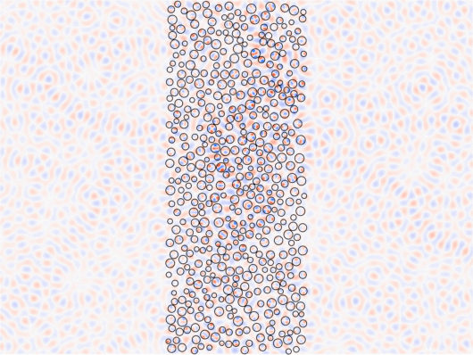

# Open Channel Through Disorder

In this example, we show how to use mesti2s() to compute the transmission matrix of a strongly scattering disordered medium, analyze the transmission matrix to determine an incident wavefront that can penetrate the disorder with almost 100% transmission (called an "open channel"), and then use mesti2s() again to compute the field profile of the open channel while comparing to that of a typical plane-wave input. We do so for both TM and TE polarizations.

# System parameters

```matlab
clear

% Dimensions of the system, in units of the wavelength lambda_0
dx      = 1/20; % discretization grid size
W       = 30;   % width of the scattering region
L       = 12;   % thickness of the scattering region
L_tot   = 40;   % full length of the system for plotting
r_min   = 0.2;  % minimal radius of the cylindrical scatterers
r_max   = 0.4;  % maximal radius of the cylindrical scatterers
min_sep = 0.05; % minimal separation between cylinders
number_density = 1.3; % number density, in units of 1/lambda_0^2
rng_seed = 0;   % random number generator seed

% Relative permittivity, unitless
epsilon_scat = 2.0^2; % cylindrical scatterers
epsilon_bg   = 1.0^2; % background in the scattering region
epsilon_L    = 1.0^2; % frees space on the left
epsilon_R    = 1.0^2; % frees space on the right

yBC = 'periodic'; % boundary condition in y

% Generate a random collection of non-overlapping cylinders
% Note subpixel smoothing is not applied for simplicity
build_TM = true;
build_TE = true;
[epsilon, inv_epsilon, x0_list, y0_list, r0_list] = ...
    build_epsilon_disorder(W, L, r_min, r_max, min_sep, number_density, ...
    rng_seed, dx, epsilon_scat, epsilon_bg, build_TM, build_TE, yBC);

% Do subpixel smoothing for inv_epsilon{1}(:,1) and inv_epsilon{1}(:,end) used
% for TE, which are at the boundary of the scattering region and the free space.
inv_epsilon{1}(:,1)   = ((1/epsilon_L) + (1/epsilon_bg))/2;
inv_epsilon{1}(:,end) = ((1/epsilon_R) + (1/epsilon_bg))/2;
```

# Compute the transmission matrix for TM polarization

```matlab
syst.polarization = 'TM';
syst.epsilon = epsilon;
syst.epsilon_L = epsilon_L;
syst.epsilon_R = epsilon_R;
syst.length_unit  = 'lambda_0';
syst.wavelength = 1;
syst.dx = dx;
syst.yBC = yBC;

% Transmission matrix: input from left, output to the right
[t, channels] = mesti2s(syst, {'left'}, {'right'});
```
```
System size: ny = 600, nx = 240 => 242; N_prop= {61, 61}
xBC = {outgoing, outgoing}; yBC = periodic; Ez polarization
Building G0 ... elapsed time:   0.050 secs
Building B,C... elapsed time:   0.001 secs
            ... elapsed time:   0.008 secs
Building A  ... elapsed time:   0.069 secs
< Method: APF using MUMPS with AMD ordering (symmetric K) >
Building K  ... elapsed time:   0.058 secs
Analyzing   ... elapsed time:   0.107 secs
Factorizing ... elapsed time:   0.740 secs
          Total elapsed time:   1.084 secs
```

# Compare an open channel and a plane-wave input

```matlab
% The most-open channels is the singular vector of the transmission matrix with 
% the largest singular value.
[~, sigma_max, v_max] = svds(t, 1, 'largest');

N_prop_L = channels.L.N_prop; % number of propagating channels on the left
ind_normal = round((N_prop_L+1)/2); % index of the normal-incident plane-wave

% Compare the transmission
T_avg = sum(abs(t).^2,'all')/N_prop_L; % average over all channels
T_PW  = sum(abs(t(:,ind_normal)).^2); % normal-incident plane-wave
T_open = sigma_max^2; % open channel
fprintf('T_avg  = %f\nT_PW   = %f\nT_open = %f\n', T_avg, T_PW, T_open)
```
```
T_avg  = 0.113158
T_PW   = 0.177535
T_open = 0.989225
```

```matlab
% Specify two incident wavefronts:
% (1) normal-incident plane-wave
% (2) open channel
in.v_L = zeros(N_prop_L, 2);
in.v_L(ind_normal, 1) = 1;
in.v_L(:, 2) = v_max;

% We will also get the field profile in the free spaces on the two sides, for
% plotting purpose.
opts.nx_L = round((L_tot-L)/2/dx);
opts.nx_R = opts.nx_L;

% Set out = [] for field-profile computations
Ez = mesti2s(syst, in, [], opts);
```
```
System size: ny = 600, nx = 240 => 242; N_prop= {61, 61}
xBC = {outgoing, outgoing}; yBC = periodic; Ez polarization
Building G0 ... elapsed time:   0.054 secs
Building B,C... elapsed time:   0.001 secs
            ... elapsed time:   0.000 secs
Building A  ... elapsed time:   0.067 secs
< Method: factorize_and_solve using MUMPS with AMD ordering >
Analyzing   ... elapsed time:   0.172 secs
Factorizing ... elapsed time:   0.816 secs
Solving     ... elapsed time:   0.104 secs
            ... elapsed time:   0.064 secs
          Total elapsed time:   1.324 secs
```

# Animate the field profiles

```matlab
% Normalize the field amplitude with respect to the plane-wave-input profile
Ez = Ez/max(abs(Ez(:,:,1)), [], 'all');

nperiod = 2; % Number of periods to animate
nframes_per_period = 20; % Number of frames per period

% x and y coordinates of the centers of the Ez pixels
[ny_Ez, nx_Ez] = size(epsilon);
x_Ez = (-(opts.nx_L-0.5):(nx_Ez+opts.nx_R))*dx;
y_Ez = (0.5:ny_Ez)*dx;

% Animate the field profile with plane-wave input
figure
animate_field_profile(Ez(:,:,1), x0_list, y0_list, r0_list, x_Ez, y_Ez, ...
    nperiod, nframes_per_period);
```


```matlab
% Animate the field profile of the open channel
figure
animate_field_profile(Ez(:,:,2), x0_list, y0_list, r0_list, x_Ez, y_Ez, ...
    nperiod, nframes_per_period);
```


# TE polarization

```matlab
syst.polarization = 'TE';
syst.inv_epsilon = inv_epsilon;
[t, channels] = mesti2s(syst, {'left'}, {'right'});
```
```
System size: ny = 600, nx = 241 => 241; N_prop= {61, 61}
xBC = {outgoing, outgoing}; yBC = periodic; Hz polarization
Building G0 ... elapsed time:   0.042 secs
Building B,C... elapsed time:   0.001 secs
            ... elapsed time:   0.004 secs
Building A  ... elapsed time:   0.087 secs
< Method: APF using MUMPS with AMD ordering (symmetric K) >
Building K  ... elapsed time:   0.053 secs
Analyzing   ... elapsed time:   0.109 secs
Factorizing ... elapsed time:   0.766 secs
          Total elapsed time:   1.085 secs
```

```matlab
[~, sigma_max, v_max] = svds(t, 1, 'largest');
N_prop_L = channels.L.N_prop; % number of propagating channels on the left
ind_normal = round((N_prop_L+1)/2); % index of the normal-incident plane-wave
T_avg = sum(abs(t).^2,'all')/N_prop_L; % average over all channels
T_PW  = sum(abs(t(:,ind_normal)).^2); % normal-incident plane-wave
T_open = sigma_max^2; % open channel
fprintf('T_avg  = %f\nT_PW   = %f\nT_open = %f\n', T_avg, T_PW, T_open)
```
```
T_avg  = 0.171411
T_PW   = 0.198797
T_open = 0.981566
```

```matlab
in.v_L = zeros(N_prop_L, 2);
in.v_L(ind_normal, 1) = 1;
in.v_L(:, 2) = v_max;
Hz = mesti2s(syst, in, [], opts);
```
```
System size: ny = 600, nx = 241 => 241; N_prop= {61, 61}
xBC = {outgoing, outgoing}; yBC = periodic; Hz polarization
Building G0 ... elapsed time:   0.048 secs
Building B,C... elapsed time:   0.001 secs
            ... elapsed time:   0.000 secs
Building A  ... elapsed time:   0.087 secs
< Method: factorize_and_solve using MUMPS with AMD ordering >
Analyzing   ... elapsed time:   0.196 secs
Factorizing ... elapsed time:   0.805 secs
Solving     ... elapsed time:   0.107 secs
            ... elapsed time:   0.068 secs
          Total elapsed time:   1.325 secs
```

```matlab
% x and y coordinates of the centers of the Hz pixels
nx_Hz = size(inv_epsilon{1}, 2);
ny_Hz = size(inv_epsilon{2}, 1);
if ismember(lower(yBC), lower({'Bloch', 'periodic', 'PMC', 'PMCPEC'}))
    dm_Hz = 0; % y = m*dx with m = 1 to ny_Hz
else
    dm_Hz = 1; % y = (m-1)*dx with m = 1 to ny_Hz
end
x_Hz = ((-opts.nx_L):(nx_Hz-1+opts.nx_R))*dx;
y_Hz = ((1:ny_Hz)-dm_Hz)*dx;

% Animate the field profile of the open channel
figure
Hz = Hz/max(abs(Hz(:,:,1)), [], 'all'); % Normalize with respect to the plane-wave-input profile
animate_field_profile(Hz(:,:,2), x0_list, y0_list, r0_list, x_Hz, y_Hz, ...
    nperiod, nframes_per_period);
```


