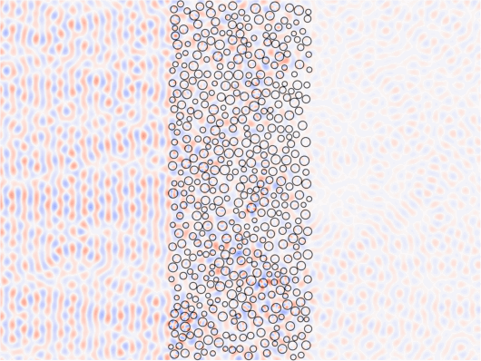
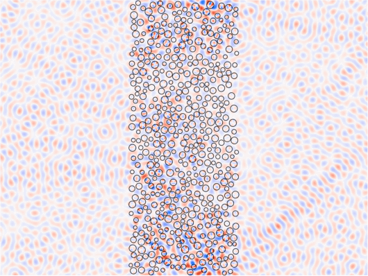

# Open Channel Through Disorder


In this example, we show how to use mesti2s() to compute the transmission matrix of a strongly scattering disordered medium, analyze the transmission matrix to determine an incident wavefront that can penetrate the disorder with almost 100% transmission (called an "open channel"), and then use mesti2s() again to compute the field profile of the open channel while comparing to that of a typical plane-wave input.


# System parameters

```matlab:Code
clear

% Dimensions of the system, in units of the wavelength lambda_0
dx      = 1/20; % discretization grid size
W       = 30;   % width of the scattering region
L       = 12;   % thickness of the scattering region
L_tot   = 40;   % full length of the system for plotting
r_min   = 0.2;  % minimal radius of the cylindrical scatterers
r_max   = 0.4;  % maximal radius of the cylindrical scatterers
min_sep = 0.05; % minimal separation between cylinders
nummber_density = 1.3; % number density, in units of 1/lambda_0^2
rng_seed = 0;   % random number generator seed

% Relative permittivity, unitless
epsilon_scat = 2.0^2; % cylindrical scatterers
epsilon_bg   = 1.0^2; % background in the scattering region
epsilon_L    = 1.0^2; % frees space on the left
epsilon_R    = 1.0^2; % frees space on the right

% Generate a random collection of non-overlapping cylinders
[epsilon, x0_list, y0_list, r0_list] = ...
    build_epsilon_disorder(W, L, r_min, r_max, min_sep, nummber_density, ...
    rng_seed, dx, epsilon_scat, epsilon_bg);
```

# Compute the transmission matrix

```matlab:Code
syst.epsilon = epsilon;
syst.epsilon_L = epsilon_L;
syst.epsilon_R = epsilon_R;
syst.length_unit  = 'lambda_0';
syst.wavelength = 1;
syst.dx = dx;
syst.yBC = 'periodic';

% Transmission matrix: input from left, output to the right
[t, channels, ~] = mesti2s(syst, {'left'}, {'right'});
```

System size: ny = 600, nx = 240 => 242; N_prop= {61, 61}
xBC = {self-energy, self-energy}; yBC = periodic
Building G0...  elapsed time:   0.050 secs
Building B,C... elapsed time:   0.001 secs
                         ... elapsed time:   0.008 secs
Building A...   elapsed time:   0.069 secs
< Method: SCSA using MUMPS with AMD ordering (symmetric K) >
Building K...   elapsed time:   0.058 secs
Analyzing...    elapsed time:   0.107 secs
Factorizing...  elapsed time:   0.740 secs
              Total elapsed time:   1.084 secs

# Compare an open channel and a plane-wave input

```matlab:Code
% The most-open channels is the singular vector of the transmission matrix with 
% the largest singular value.
[~, sigma_max, v_max] = svds(t, 1, 'largest');

N_prop_L = channels.L.N_prop; % number of propagating channels on the left
ind_normal = round((N_prop_L+1)/2); % index of the normal-incident plane-wave

% Compare the transmission
T_avg = sum(abs(t).^2,'all')/N_prop_L; % average over all channels
T_PW  = sum(abs(t(:,ind_normal)).^2); % normal-incident plane-wave
T_open = sigma_max^2; % open channel
fprintf('T_avg  = %f\nT_PW   = %f\nT_open = %f\n', T_avg, T_PW, T_open)
```

T_avg  = 0.113158
T_PW   = 0.177535
T_open = 0.989225


```matlab:Code
% Specify two incident wavefronts:
% (1) normal-incident plane-wave
% (2) open channel
in.v_L = zeros(N_prop_L, 2);
in.v_L(ind_normal, 1) = 1;
in.v_L(:, 2) = v_max;

% We will also get the field profile in the free spaces on the two sides, for
% plotting purpose.
opts.nx_L = round((L_tot-L)/2/dx);
opts.nx_R = opts.nx_L;

% Set out = [] for field-profile computations
[field_profiles, ~, ~] = mesti2s(syst, in, [], opts);
```

System size: ny = 600, nx = 240 => 242; N_prop= {61, 61}
xBC = {self-energy, self-energy}; yBC = periodic
Building G0...  elapsed time:   0.054 secs
Building B,C... elapsed time:   0.001 secs
                     ... elapsed time:   0.000 secs
Building  A...  elapsed time:   0.067 secs
< Method: factorize_and_solve using MUMPS with AMD ordering >
Analyzing...    elapsed time:   0.172 secs
Factorizing...  elapsed time:   0.816 secs
Solving...      elapsed time:   0.104 secs
             ...      elapsed time:   0.064 secs
             Total elapsed time:   1.324 secs

# Animate the field profiles

```matlab:Code
% Normalize the field amplitude with respect to the plane-wave-input profile
field_profiles = field_profiles/max(abs(field_profiles(:,:,1)), [], 'all');

nperiod = 2; % Number of periods to animate
nframes_per_period = 20; % Number of frames per period

% x and y coordinates of the centers of the pixels
[ny, nx] = size(epsilon);
x = (-(opts.nx_L-0.5):(nx+opts.nx_R))*dx;
y = (0.5:ny)*dx;

% Aanimate the field profile with plane-wave input
animate_field_profile(field_profiles(:,:,1), x0_list, y0_list, r0_list, x, y, ...
    nperiod, nframes_per_period);
```





```matlab:Code
% Aanimate the field profile of the open channel
animate_field_profile(field_profiles(:,:,2), x0_list, y0_list, r0_list, x, y, ...
    nperiod, nframes_per_period);
```




